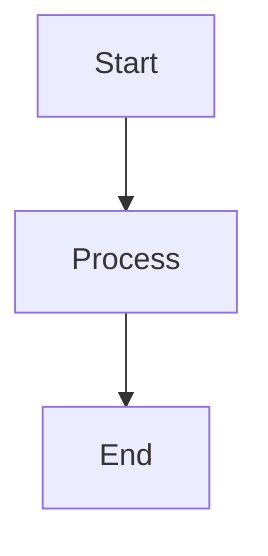
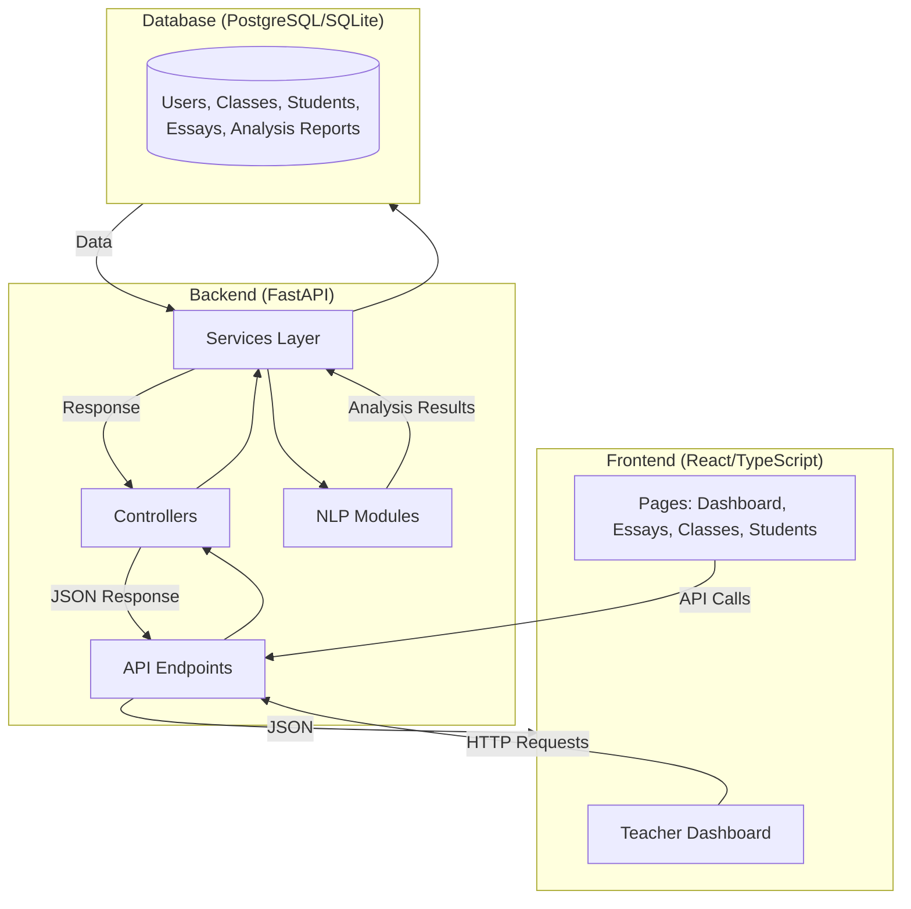
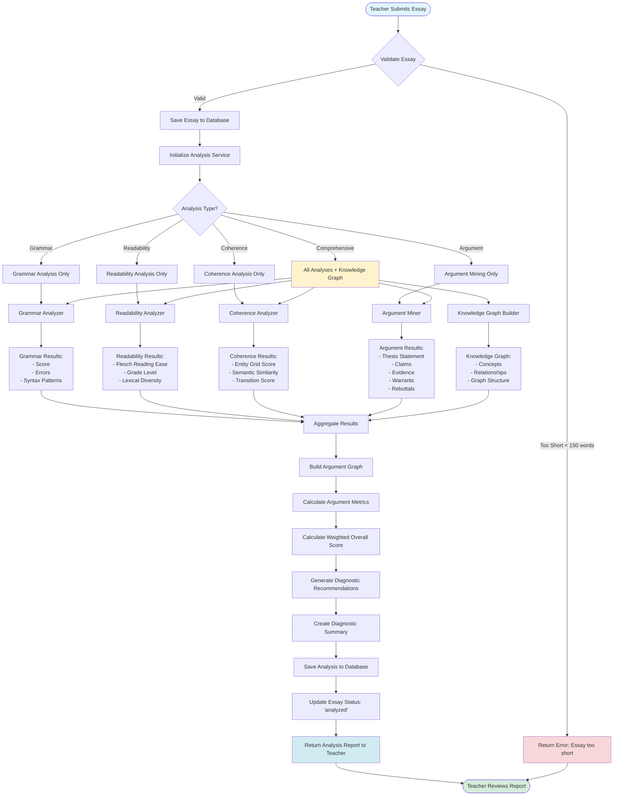
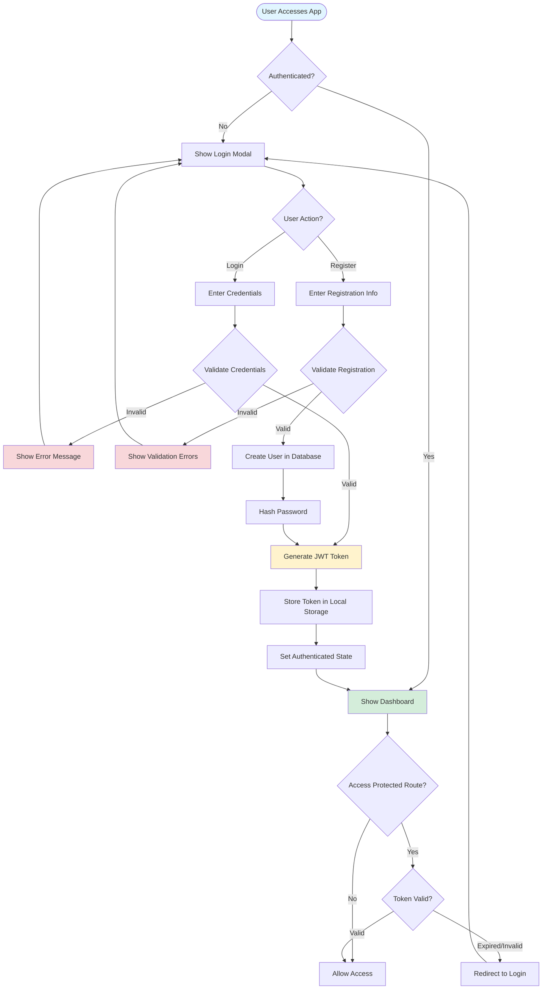
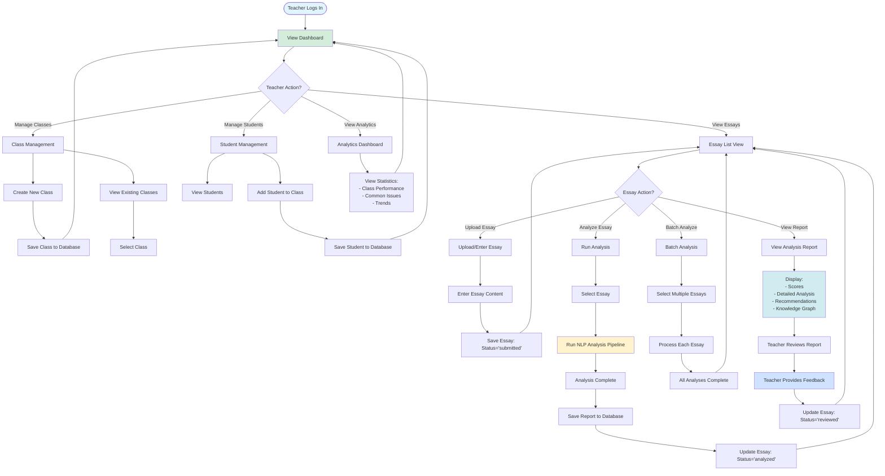
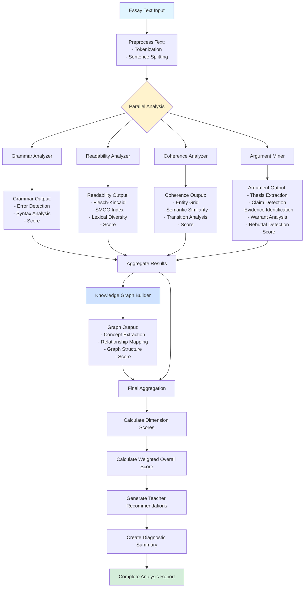

# Flowchart Guide for EduCompose

This guide explains how to create flowcharts for the EduCompose project and provides sample flowcharts for key processes.

## Table of Contents

1. [Flowchart Tools](#flowchart-tools)
2. [System Architecture Flow](#system-architecture-flow)
3. [Essay Analysis Flow](#essay-analysis-flow)
4. [User Authentication Flow](#user-authentication-flow)
5. [Teacher Workflow Flow](#teacher-workflow-flow)
6. [Database Flow](#database-flow)

---

## Flowchart Tools

### Recommended Tools

1. **Mermaid** (Recommended for Markdown)

   - Built into GitHub, GitLab, and many documentation platforms
   - Syntax is simple and version-controllable
   - Use in `.md` files with ` ```mermaid ` code blocks

2. **Draw.io / diagrams.net**

   - Free, web-based tool
   - Export to PNG, SVG, PDF
   - Good for complex diagrams

3. **Lucidchart**

   - Professional tool with templates
   - Collaboration features
   - Free tier available

4. **PlantUML**
   - Text-based diagramming
   - Good for technical documentation
   - Integrates with many tools

### Quick Start with Mermaid

Create a file with `.md` extension and use:

````markdown

````

---

## System Architecture Flow

### High-Level System Overview



---

## Essay Analysis Flow

### Complete Essay Analysis Pipeline



---

## User Authentication Flow

### Login and Registration Process



---

## Teacher Workflow Flow

### Complete Teacher Workflow



---

## Database Flow

### Data Flow Through Database

```mermaid
flowchart LR
    subgraph Application["Application Layer"]
        API[API Endpoints]
        Controllers[Controllers]
        Services[Services]
    end

    subgraph ORM["SQLAlchemy ORM"]
        Models[Models:<br/>User, Class, Student, Essay, AnalysisReport]
        Sessions[Database Sessions]
    end

    subgraph Database["PostgreSQL/SQLite"]
        Users[(users table)]
        Classes[(classes table)]
        Students[(students table)]
        Essays[(essays table)]
        Reports[(analysis_reports table)]
    end

    API --> Controllers
    Controllers --> Services
    Services --> Models
    Models --> Sessions
    Sessions -->|CRUD Operations| Database

    Database -->|Query Results| Sessions
    Sessions -->|ORM Objects| Models
    Models -->|Data| Services
    Services -->|Business Logic| Controllers
    Controllers -->|JSON Response| API

    style Application fill:#e1f5ff
    style ORM fill:#fff3cd
    style Database fill:#d4edda
```



---

## NLP Analysis Module Flow

### Detailed NLP Processing Flow



---

## How to Use These Flowcharts

### 1. In Markdown Files

Copy any of the Mermaid flowchart code blocks above into your `.md` files. They will render automatically on:

- GitHub
- GitLab
- Many documentation platforms
- VS Code with Mermaid extensions

### 2. Export to Images

Use online tools:

- [Mermaid Live Editor](https://mermaid.live/) - Paste code, export as PNG/SVG
- [Draw.io](https://app.diagrams.net/) - Import Mermaid or recreate manually

### 3. Customize Flowcharts

Modify the Mermaid syntax:

- Change shapes: `[Rectangle]`, `{Diamond}`, `([Rounded])`
- Add colors: `style NodeName fill:#color`
- Add subgraphs: `subgraph Name["Label"] ... end`
- Change direction: `flowchart TD` (top-down), `LR` (left-right), `TB` (top-bottom)

### 4. Add to Documentation

Include flowcharts in:

- `README.md` - System overview
- `backend/DOCUMENTATION.md` - Technical details
- `docs/` - Detailed process documentation

---

## Flowchart Best Practices

1. **Start Simple**: Begin with high-level flows, then add detail
2. **Use Consistent Shapes**:
   - Rectangles for processes
   - Diamonds for decisions
   - Rounded rectangles for start/end
3. **Label Clearly**: Use descriptive labels
4. **Color Code**: Use colors to distinguish different types of operations
5. **Keep It Readable**: Don't overcrowd - split complex flows into multiple diagrams
6. **Version Control**: Keep flowchart code in version control (Mermaid is text-based)

---

## Additional Resources

- [Mermaid Documentation](https://mermaid.js.org/)
- [Mermaid Live Editor](https://mermaid.live/)
- [Flowchart Symbols Guide](https://www.lucidchart.com/pages/flowchart-symbols-meaning)

---

## Next Steps

1. Choose a flowchart tool that works for your workflow
2. Start with the System Architecture Flow to understand the big picture
3. Use the Essay Analysis Flow for detailed technical documentation
4. Customize flowcharts for your specific documentation needs
5. Keep flowcharts updated as the system evolves
